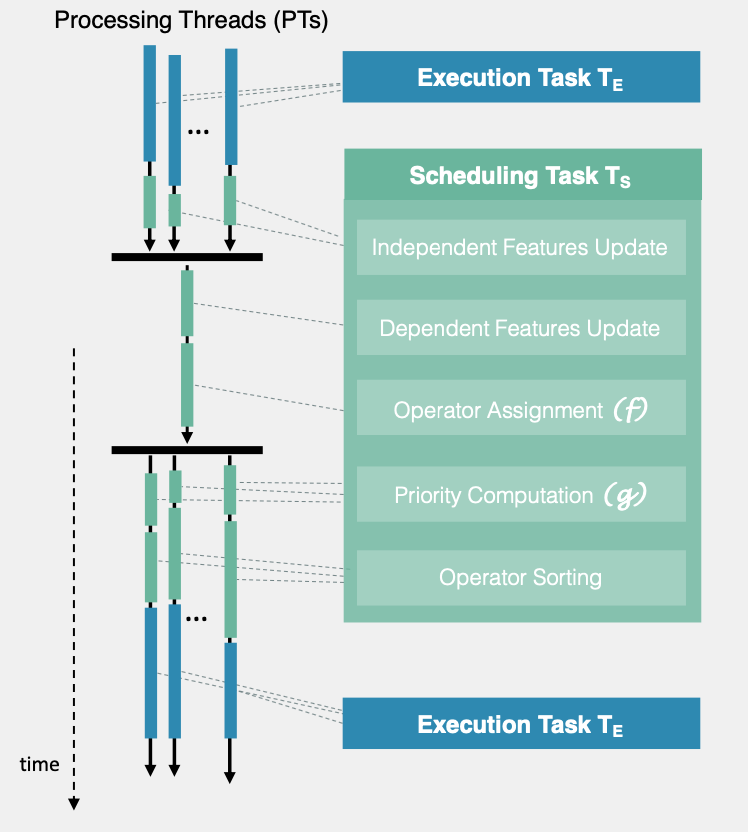

# Haren

Haren is a **scheduling framework for stream processing systems**. It executes streaming operators 
using a group of Processing Threads (PTs) and allows the developer to easily implement and enforce
scheduling policies. It abstracts the state of streaming components as abritrary *features*, that are
used by *user-defined scheduling functions* to define intra- and inter-thread scheduling rules. 

For detailed information, please refer to the ACM DEBS'19 publication introducing the framework:

> *Dimitris Palyvos-Giannas, Vincenzo Gulisano, and Marina Papatriantafilou*. 2019. **Haren: A Framework for Ad-Hoc Thread Scheduling Policies for Data Streaming Applications**. In Proceedings of the 13th ACM International Conference on Distributed and Event-based Systems (DEBS ‘19). ACM, New York, NY, USA, 19-30. DOI: https://doi.org/10.1145/3328905.3329505

## Usage

Haren can be coupled with an SPE using the `Task` and `HarenScheduler` entities, where a Task is a
unit of execution (e.g., an operator) that will be scheduled by `HarenScheduler`.
The scheduling behavior is controlled by defining an appropriate 
`InterThreadSchedulingFunction`, which controls the assignment of a `Task` to processing threads and
an `IntraThreadSchedulingFunction`,
which controls the prioritization of tasks in each thread.

### Scheduling Phases

The figure below shows a high-level overview of the different scheduling stages of Haren.

